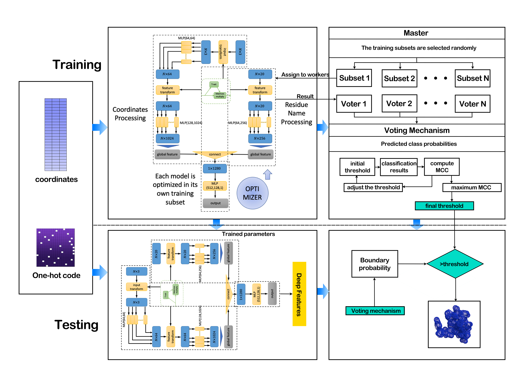

# **TMPBDSniffer**

In this work we defined the binding domain of TMPs according to the binding region investigation of multiple conjugate types. The experimental results proved such binding domains existing on the surface of TMPs, and they are structural specific distinguishing to the surface regions without any binding activities.

## Citation

The existence of TMPs binding domain have been proved and published in the the 2021 IEEE International Conference on Bioinformatics and Biomedicine (BIBM).

```
Y. Bao, W. Wang, M. Dong, F. He and H. Wang, "Discover the Binding Domain of Transmembrane Proteins Based on Structural Universality," 2021 IEEE International Conference on Bioinformatics and Biomedicine (BIBM), 2021, pp. 5-11, doi: 10.1109/BIBM52615.2021.9669493.
```

## Model pipline

<p align="center"></p>

## Datasets

The size of the entire dataset is greater than 30G, if you are interest in this work, please contact baoyh078@nenu.edu.cn

## Requirements

- Python >= 3.6
- Pytorch
- Biopython (needed if you want to prepare the dataset by yourself)
- MSMS (use by biopython, needed if you want to prepare the dataset by yourself )

## Sniffer Part

we have developed the sniffer part, code will be released after the paper have been published

